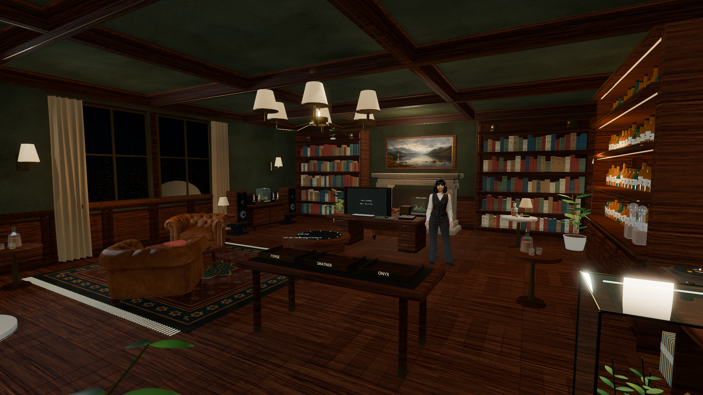
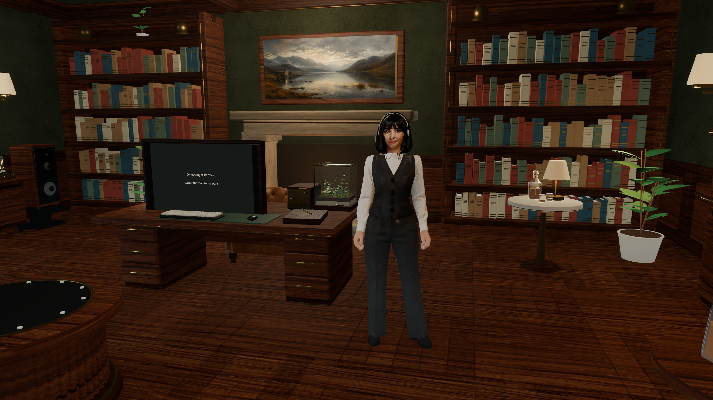
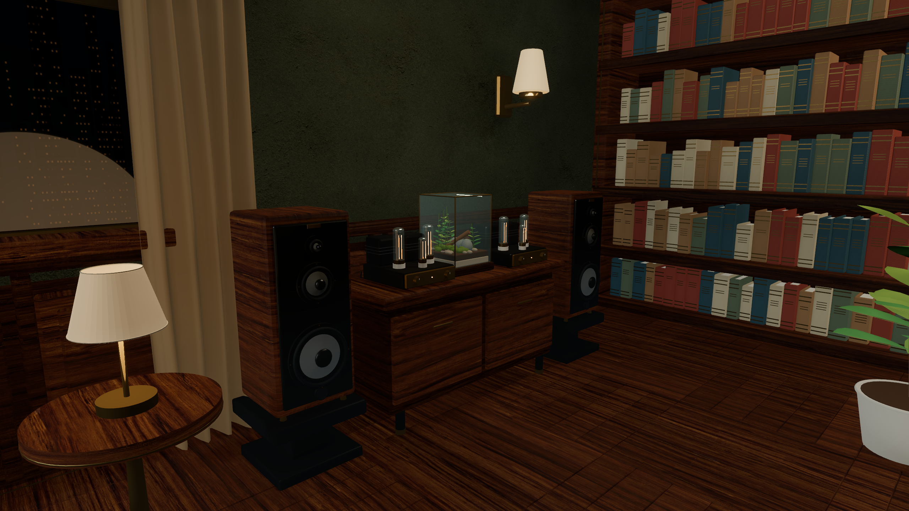
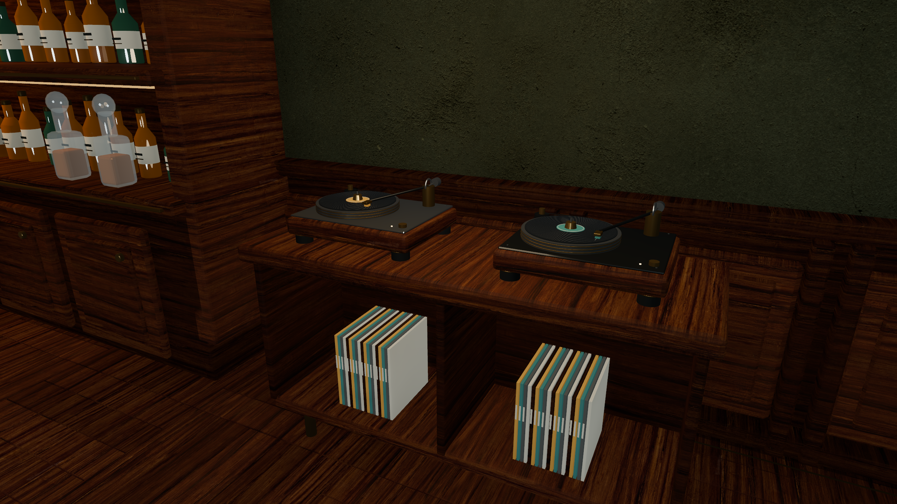
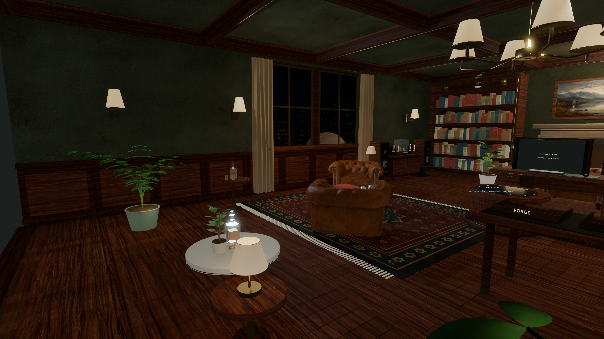
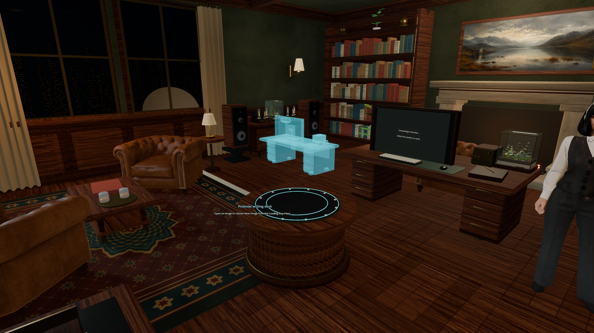
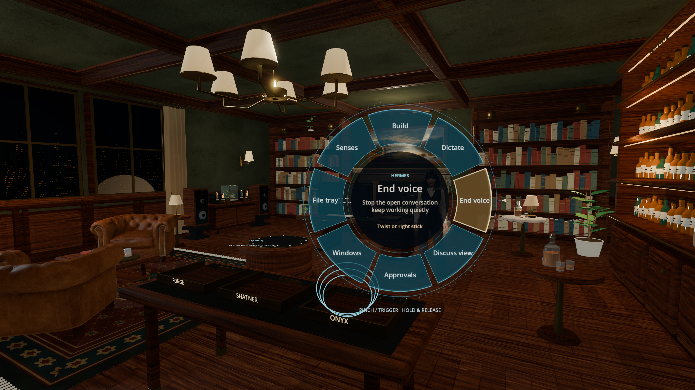

# Inside the Whiskey Room

Seven unedited native Godot captures at **2560 × 1440**, made from the public application on September 6, 2026. Click any image for its original PNG.

The room, character, materials, hologram and menu are rendered by the application. Desktop overlays are hidden for the gallery and the workspace starts empty, so no private documents or conversations appear. The monitor's connection placeholder is visible because this capture does not launch Hermes. These are desktop Vulkan Forward+ images, not Quest headset captures or stereo-performance measurements.

## A room to work in

[](screenshots/01-whiskey-room.png)

## Hermes beside the shared desk

[](screenshots/02-hermes-at-the-desk.png)

The current reconstructed companion, with headphones and waistcoat. This is the shipped character; the deferred Unreal/Hannah conversion is not represented here.

## The listening corner

[](screenshots/03-listening-corner.png)

## Records after hours

[](screenshots/04-vinyl-and-valves.png)

## The lounge

[](screenshots/05-planted-lounge.png)

## Something taking shape

[](screenshots/06-hologram-podium.png)

The actual podium displaying the bundled desk model with its hologram material. No image-to-object job was submitted for this screenshot.

## The wrist interface

[](screenshots/07-wrist-interface.png)

The application's built-in **simulated wrist pose** displays the tracking rings and anchored menu. No physical hand is captured, no menu action is activated, and this does not certify headset tracking. “End voice” is a highlighted menu option; no recording or conversation is running.

## People and provenance

See **[CREDITS](../CREDITS.md)** for named creators, upstream contributors and original projects. The room's Poly Haven textures credit **Dario Barresi, Dimitrios Savva, Rico Cilliers and Rob Tuytel**. The original Hermes3D reference credits **Luke The Dev**. Procedural furniture, generated source images, TRELLIS conversion and Blender reconstruction are distinguished in [asset provenance](ASSETS.md). The original individual character illustrator remains unidentified.

The screenshot files are covered by the project's MIT license; included CC0 texture sources retain their attribution and provenance. Hashes, sizes and origin are recorded in [the asset manifest](../assets-manifest.json). [Capture metadata](screenshots/capture-manifest.json) records camera positions, dimensions and the simulated interaction fixture.

## Reproduce the gallery

Use the pinned Godot version from [Setup](SETUP.md), with imported application assets and a functioning rendering display. Choose an absolute output directory:

```bash
.tools/Godot_v4.7.2-stable_linux.x86_64 --path app --xr-mode off \
  --audio-driver Dummy --script res://capture_gallery.gd -- \
  --gallery-output=/tmp/hermes-office-gallery
```

The script takes seven shots over roughly 40 seconds after startup. It launches the scene directly, isolates state beneath a new `private-fixture-*` directory, and does not launch integration processes, access a microphone/camera, connect remote machines or ask a model for a reply. Keep the fixture directory local. Review new captures before publishing; animation and renderer differences can change pixels between runs.
